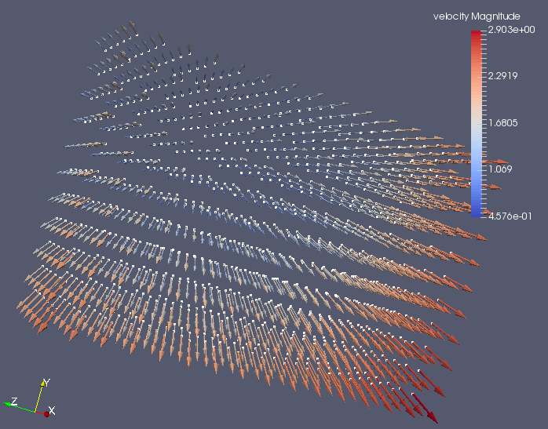

# sph
Dummy SPH program 
  * creates a particle set (cube)
  * simulates a time-integration loop:
     * generates some scalar/vector results for each particle
     * saves them to disk in paraview format
     
## build and run
```bash
mkdir build
cd build
cmake ..
make
./sph
```
see also [CMake](https://cmake.org/)

## results
The program generates 20 [VTK](http://www.vtk.org/) files which can be loaded into [Paraview](http://www.paraview.org/)




